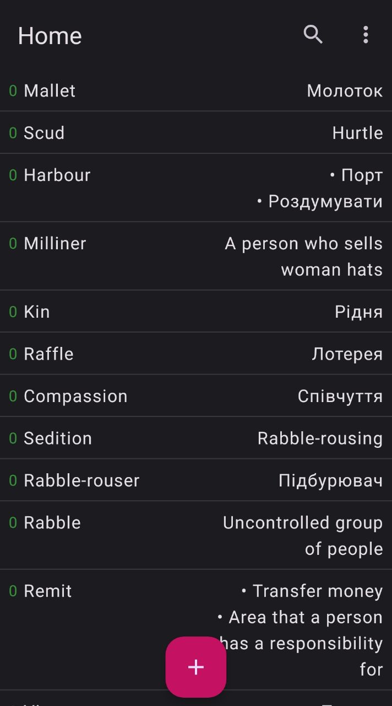
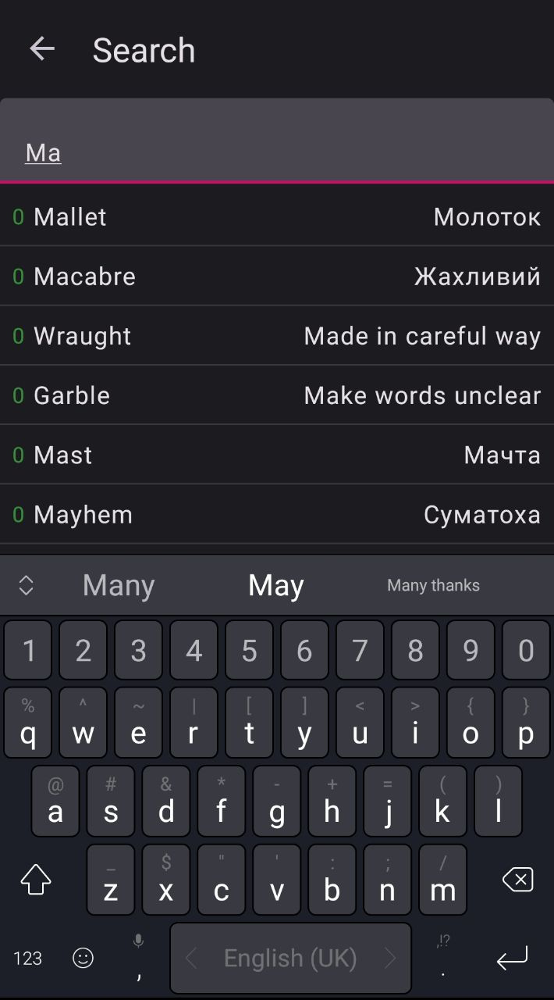
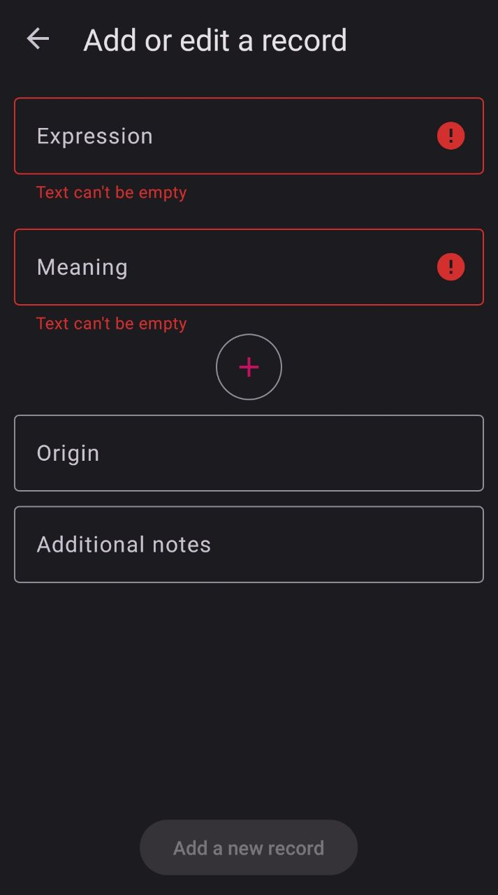

<h1 align="center">Digi Dictionary</h1> <br/>

A small Android application which helps you to learn new words and expressions.
You can:
- List all of your expressions.
- Add, edit, delete them.
- Search
- Revise them. By default, you only see random expressions without their meanings.
The idea is to tell their meanings, click on the item and if you answered correct, then you click "Correct", if wrong, click "Wrong".
Each record has a score.
If it is answered correct in the revision, then some score points are added to score, if wrong, some points are subtracted.
In the settings, you can specify how much points you want to add, when you answer correct, and subtract, when you answer wrong.
In the next revision, records with negative score will definitely appear and you are given a chance to answer them again 
in hope you will do that correct.   

There's also a widget which shows you records that were added during last 24 hours. 

## Screenshots

<p align="center">
  
  
  
</p>

## License

```
MIT License

Copyright (c) 2022 Khmaruk Oleg

Permission is hereby granted, free of charge, to any person obtaining a copy
of this software and associated documentation files (the "Software"), to deal
in the Software without restriction, including without limitation the rights
to use, copy, modify, merge, publish, distribute, sublicense, and/or sell
copies of the Software, and to permit persons to whom the Software is
furnished to do so, subject to the following conditions:

The above copyright notice and this permission notice shall be included in all
copies or substantial portions of the Software.

THE SOFTWARE IS PROVIDED "AS IS", WITHOUT WARRANTY OF ANY KIND, EXPRESS OR
IMPLIED, INCLUDING BUT NOT LIMITED TO THE WARRANTIES OF MERCHANTABILITY,
FITNESS FOR A PARTICULAR PURPOSE AND NONINFRINGEMENT. IN NO EVENT SHALL THE
AUTHORS OR COPYRIGHT HOLDERS BE LIABLE FOR ANY CLAIM, DAMAGES OR OTHER
LIABILITY, WHETHER IN AN ACTION OF CONTRACT, TORT OR OTHERWISE, ARISING FROM,
OUT OF OR IN CONNECTION WITH THE SOFTWARE OR THE USE OR OTHER DEALINGS IN THE
SOFTWARE.
```